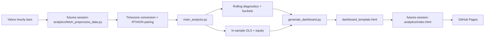

# Effect of Overnight Futures on Regular Trading Sessions

An interactive Python research project studying whether regular trading hours (RTH) returns contain information about the following overnight session.

## Explore the project

**[Open the interactive dashboard →](futures-session-analytics/index.html)**

**[Open the architecture workflow diagram →](futures-session-analytics/workflow.html)**

**[Open the codebase architecture view →](futures-session-analytics/architecture.html)**

The dashboard includes recent-window selectors, rolling correlations, continuation/reversal diagnostics, six signed RTH buckets, an in-sample OLS strategy, an always-long overnight benchmark, equity, and drawdown.

## Project structure

```text
Effect-of-overnight-Futures-on-Regular-Trading-Sessions/
├── README.md
├── index.html                         # primary dashboard, if present
├── assets/                            # README preview images
└── futures-session-analytics/
    ├── index.html                     # interactive subproject dashboard
    ├── workflow.html                   # architecture diagram
    ├── architecture.html              # presentation-style codebase map
    ├── architecture.workflow.json     # diagram specification
    ├── fetch_preprocess_data.py        # download and RTH/ON pairing
    ├── main_analysis.py                # diagnostics, OLS, equity, drawdown
    ├── generate_dashboard.py           # renders HTML from analysis output
    ├── dashboard_template.html         # dashboard template
    └── run_pipeline.py                 # one-command workflow
```

## Replicate locally

From the repository root:

```bash
python -m venv .venv
source .venv/bin/activate
pip install yfinance pandas numpy statsmodels
python -m futures_session_analytics.run_pipeline
python -m http.server 8000 --directory futures-session-analytics
```

Open <http://localhost:8000>.

The workflow downloads up to 730 days of Yahoo Finance hourly data, converts timestamps to America/New_York, pairs each completed RTH session with the following overnight session, writes CSV evidence, runs the analysis, and generates the interactive HTML.

For offline regeneration from an existing session CSV:

```bash
FSA_USE_CACHED=1 python -m futures_session_analytics.generate_dashboard
```

## Architecture



## Research scope and limitations

This project is intentionally limited to a short, contained in-sample investigation of a possible RTH-to-overnight dislocation. It is not intended to establish a production trading strategy or a general market law. OLS is fitted and evaluated on the same observations. Commissions, spreads, slippage, financing, margin, and contract-roll effects are outside the scope of this prototype. Results are not live performance or financial advice.
