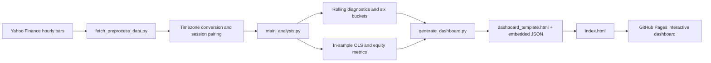

# Workflow



Run locally from the parent project directory:

```bash
FSA_USE_CACHED=1 python -m futures_session_analytics.generate_dashboard
python -m http.server 8000 --directory futures_session_analytics
```

For a fresh Yahoo download, omit `FSA_USE_CACHED=1`.
